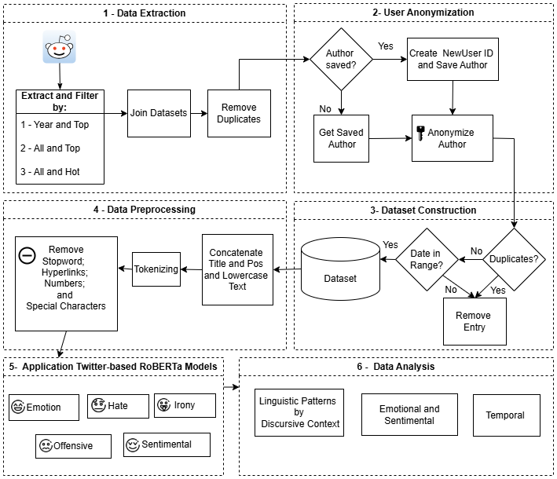

# 💬 **Pain in a Safe Space: Temporal Analysis of Discourses in the Womenintech Subreddit**

This repository contains the code, data, and materials used in our study on the temporal dynamics of toxicity and emotional expression in the *r/womenintech* subreddit over the span of one year.

---

## 📄 Abstract

This study analyzes online discourse in the *r/womenintech* subreddit to assess patterns of toxicity and emotional expression over time. We employed NLP techniques and the Goal-Question-Metric (GQM) framework to guide our analysis. Our results reveal temporal trends and emotional nuances in discussions within a safe space for women in tech.

---

## 🗂️ Repository Structure
├── dataset/ # Raw and preprocessed data used in the study

├── graphics/ # Figures and visualizations generated for the article

├── src/ # Source code for preprocessing, analysis, and modeling

└── README.md # Project documentation

## 🔐 Environment Configuration

Before running the scripts, make sure to create a `.env` file in the root directory of the project. This file should contain your API credentials and user agent, as shown below:

  ```env
        CLIENT_ID=your_reddit_client_id
        CLIENT_SECRET=your_reddit_client_secret
        AGENT=your_custom_user_agent
````
 * These values are required to access the Reddit API. You can obtain them by registering an application at https://www.reddit.com/prefs/apps.

## ⚙️ How to Reproduce
  1. Install dependencies:
     
  3. Run the scripts in the following order
     * src/1_extract_subreddit.ipynb
     * src/2_anonymization_reddit.ipynb
     * src/3_label_reddit.ipynb
     * src/4_analysis_reddit.ipynb

##  💾 Dataset
The dataset includes Reddit posts from the *r/womenintech* subreddit collected over a one-year period. Personal information has been removed or anonymized where appropriate. Data files are located in the dataset folder.

## 🧪 Methods

  

## 📈 Results
Visual outputs such as time-series plots and emotion distributions are available in the graphics folder. These figures were used in the paper to illustrate key findings.
