# Exemplo execução no Colab

Para a execução no Google Colab, você precisará  estar com seu arquivo ".env"  configurado com seus dados
([veja exemplo](tutorials/reddit_account.md)).

Temos quatro arquivos para executar, eles devem ser executados um de cada vez, seguindo a ordem indicada em seus nomes.
Para iniciar abra um notebook no Google colab em branco.

---
## Extrair do Reddit

1. Vamos carregar o script de extração dos dados do Reddit, para isso va no menu "arquivo/fazer upload de arquivo"
   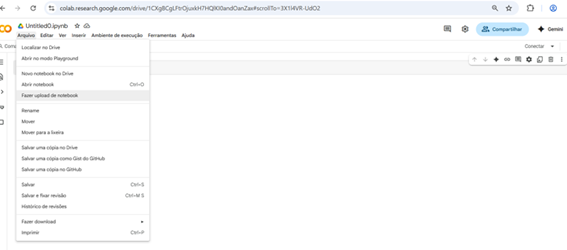

2. Irá abrir uma janela para a seleção do arquivo, navegue entre seus diretórios até encontrar o arquivo "1_extract_subreddit.ipynb".
   Selecione o arquivo indicado e clique no botão "abrir".
   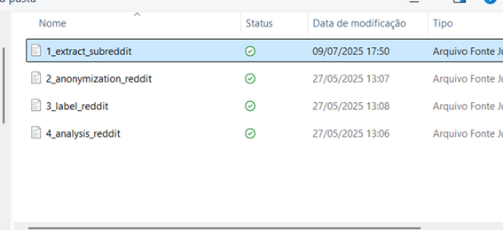
     
3. Agora que o notebook foi caregado com sucesso, vamos trazer o arquivo ".env", necessário para a extração dos dados.
   Na barra de menus a esquerda clique no icone do "diretorio", caso abra a aba "arquivos" esteja em branco,
   aguarde um momento para carregar as opções.

   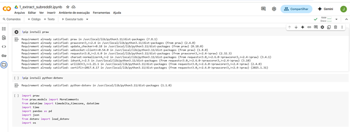

4. Na aba "arquivos" clique no icone "Upload" (arquivo com setinha para cima". Irá abrir uma janela para a escolha do arquivo desejado.
   Navegue entre os diretórios necessários até encontrar seu arquivo ".env".
   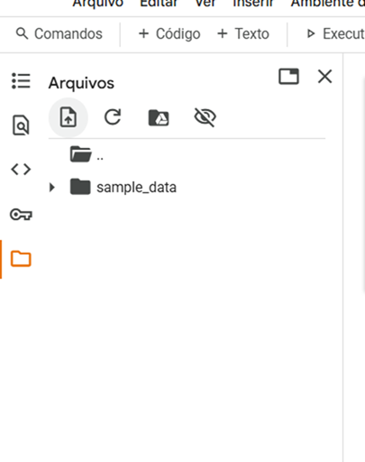

5.  Selecione seu arquivo ".env" e clique no botão "abrir".
    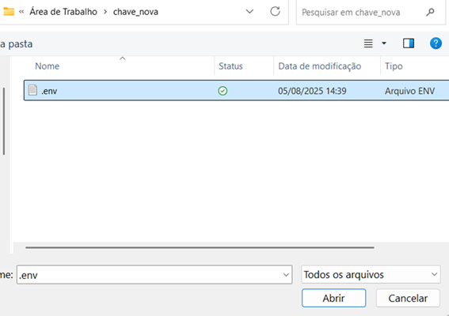

6. Aparecerá uma notificação avisando que o arquivo será apagado ao encerrar a execução do notebook, clique no botão "Ok".
   O arquivo será carregado, porém por questões de segurança não ficará visivel na aba "arquivos".
   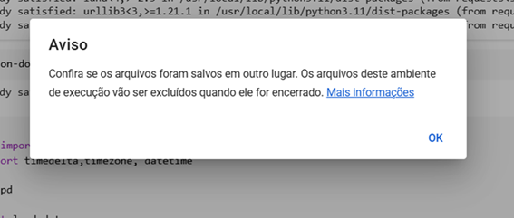

7. Agora clique no botão "executar tudo" localizada na barra de botões superior.
    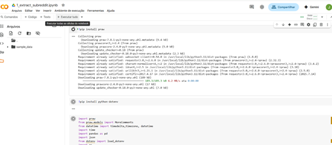

8. Quando o script terminar de executar, aparecerá na aba "arquivos" o arquivo "posts.csv".
   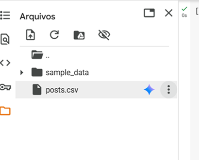

9. Agora precisamos salvar o arquivo, clique nos três pontos localizado a direita do arquivo e selecione a opção "Fazer Download".
   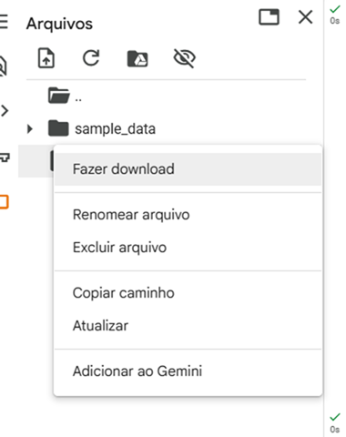

---

##  

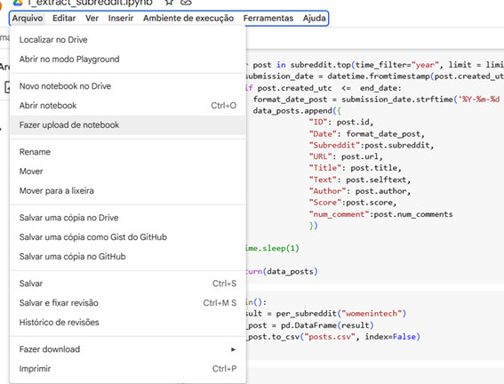

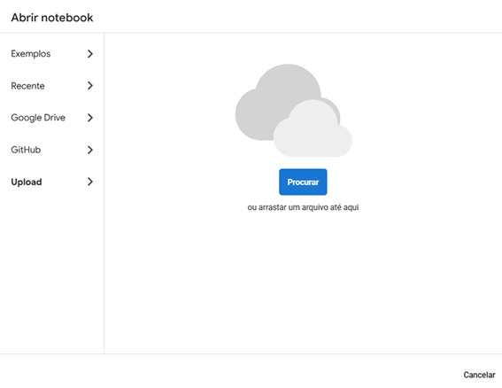

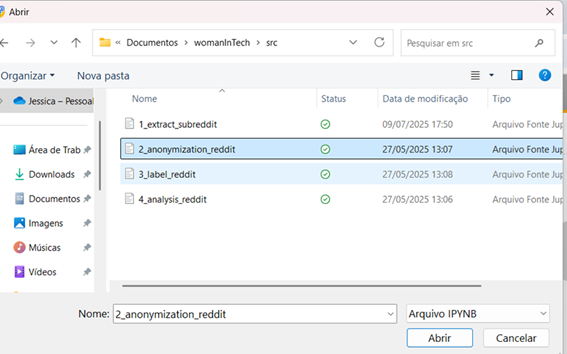

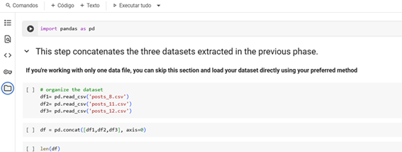

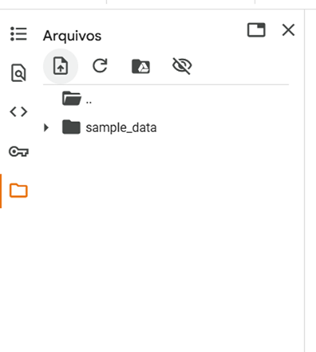

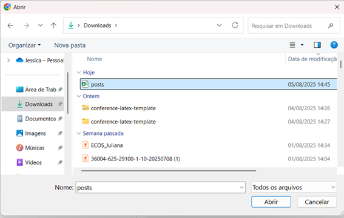

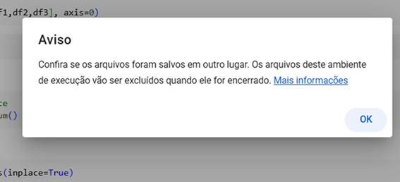

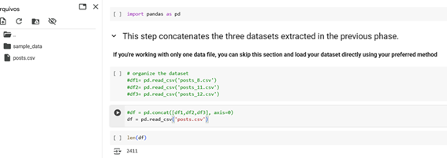

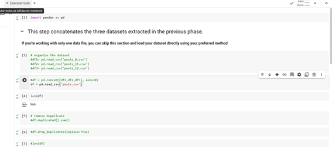

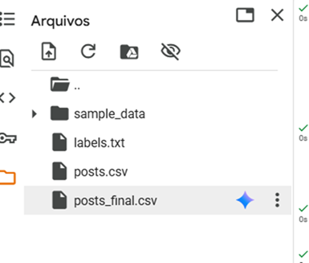

---

##

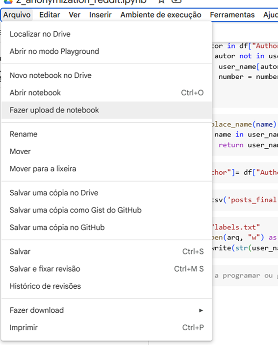

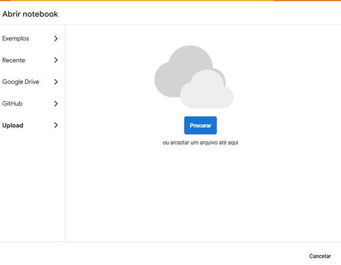

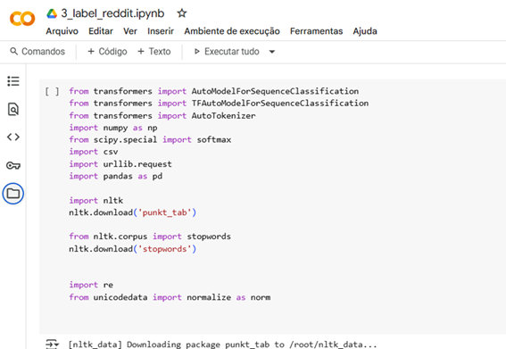

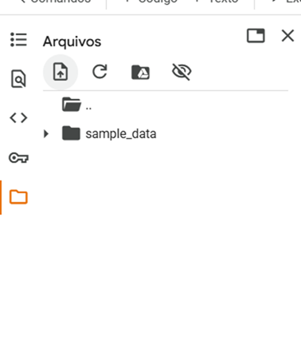

 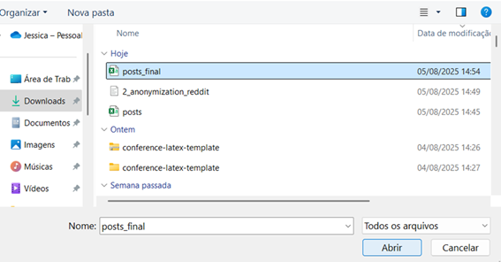 

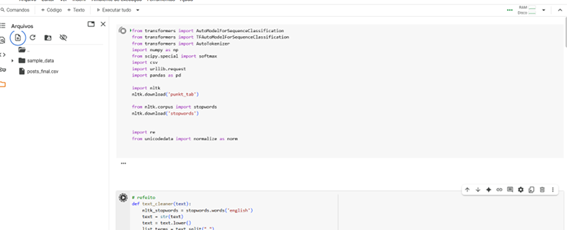

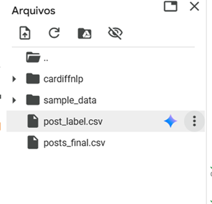

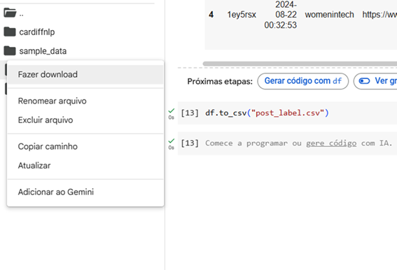

---

##

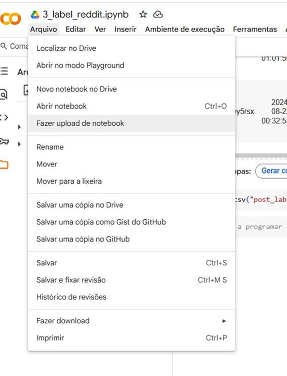

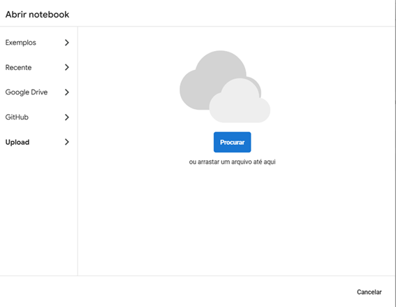

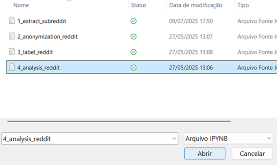

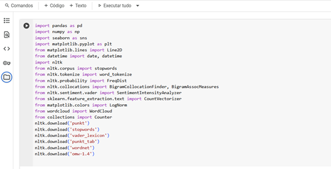

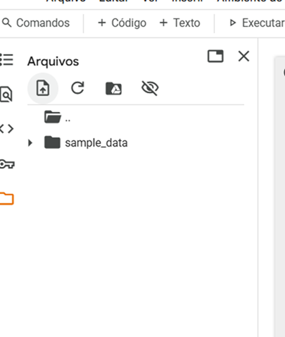

  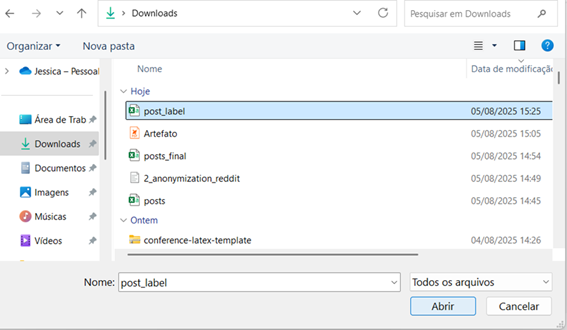

  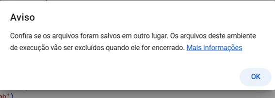

  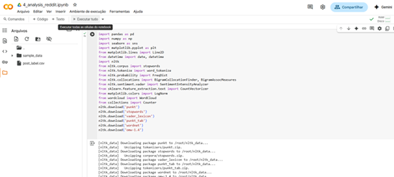
