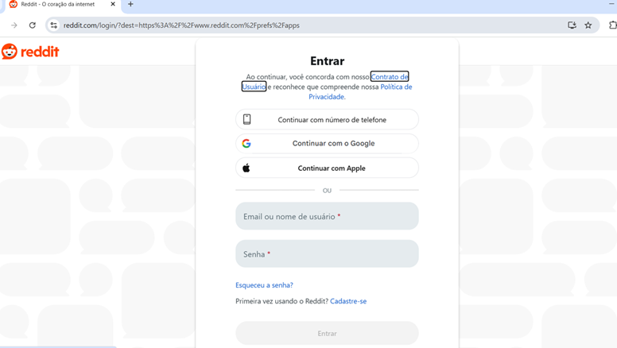
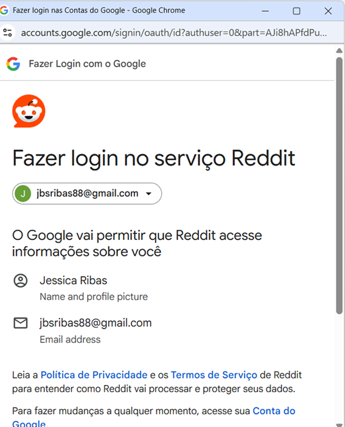
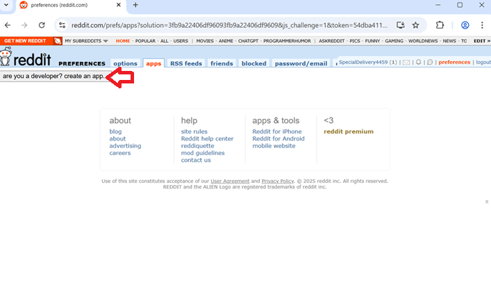
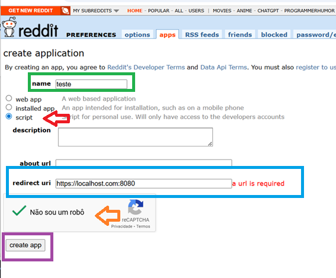
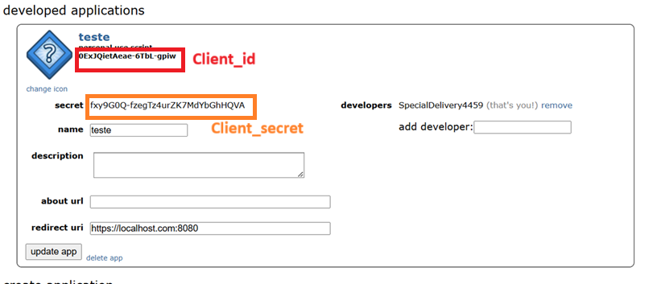
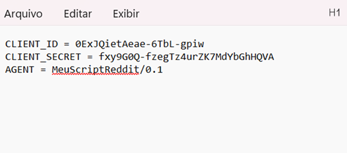

# Reddit APP

To extract data from Reddit, you need to have a developer account.  
First, you must have a valid Reddit account. If you don’t have one, you can create it by following steps 1 and 2 below:

---

1. If you clicked on the link [https://www.reddit.com/prefs/apps](https://www.reddit.com/prefs/apps), just fill in your information to create the account.

---

2. In this case, we chose to create a Reddit account by linking a Google account.

---

3. A window will appear asking you to select your topics of interest.  
You must select the topics and click **Next**. On the next screen, you can click **Skip** in the top-right corner.

---

4. Finally, the screen to create the APP will appear — that is, the screen to generate the client ID and secret key for data extraction.  
Click the **"Are you a Developer? Create an app"** button.

---

5. You will be redirected to the App registration screen.
   Fill in the **"name"** field as desired (we strongly recommend following variable naming conventions).
   Select the **"script"** option.
   In the **"redirect uri"** field, enter: http://localhost:8080.
   Check the captcha and click the **"create app"** button.

---

6. A screen will appear showing all the details of the created app. On this screen, you must copy the **client_id** and **client_secret**, as shown below:

---

7. To create your `.env` file, follow the naming rules indicated in the README. Below is an example of how the `.env` file should be filled out:

---

8. Now save your file with the name `.env`. If you're using Notepad, don’t forget to change the file type to **"All files"** before saving.

